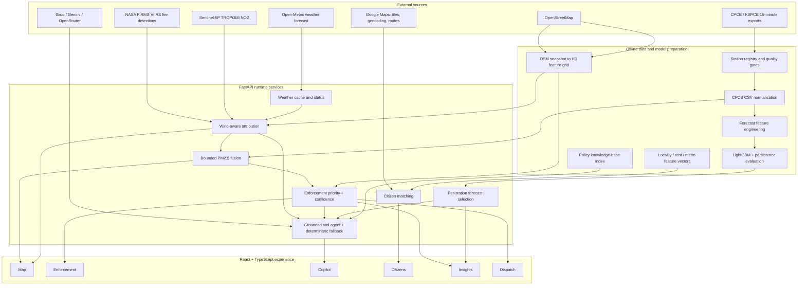
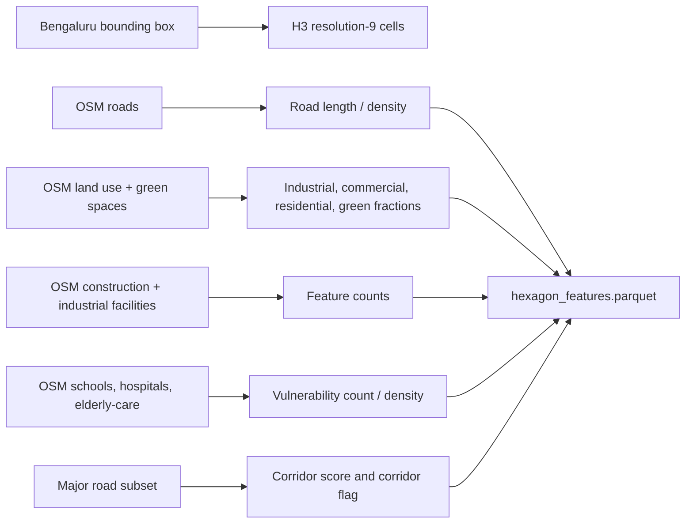
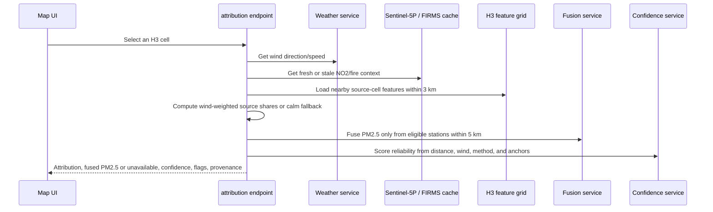
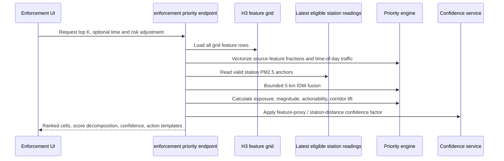
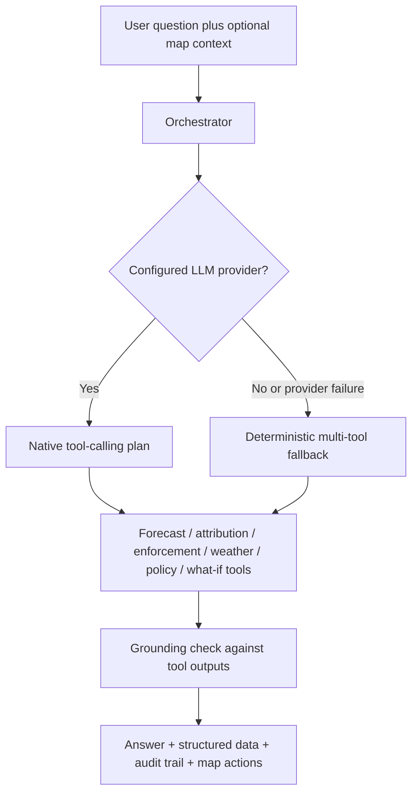

# Architecture & Data Flow

AQI Sentinel is a Bengaluru-first, full-stack decision-support system. Its architecture separates **evidence acquisition**, **offline preparation**, **runtime computation**, and **user-facing decisions** so the application can state which values are measured, derived, estimated, stale, or unavailable.

## 1. Architecture overview



## 2. Evidence sources and provenance

| Source | Role in AQI Sentinel | Cadence / resolution | Status behaviour | Important boundary |
| --- | --- | --- | --- | --- |
| **CPCB/KSPCB station CSV exports** | PM2.5, PM10, NO2, weather fields; training, forecast snapshots, station anchors | 15-minute raw exports, normalized hourly for model features | Quality-gated and stored locally | The current prototype includes 12 registered Bengaluru stations; not every station has usable PM2.5 history. |
| **Open-Meteo** | Wind direction/speed and weather forecast | Up to 72-hour forecast, city-centre weather point | Short cache, then stale-cache fallback | Wind is a city-scale context signal, not a hyperlocal sensor at every cell. |
| **OpenStreetMap** | Roads, land use, green space, construction/industrial context, vulnerability POIs | Cached Bengaluru snapshot mapped to H3 | Rebuilt by pipeline | Community-maintained features are contextual evidence, not a verified emissions registry. |
| **Sentinel-5P TROPOMI NO2 via Earth Engine** | Traffic/combustion proxy in detailed attribution | Kilometre-scale satellite column; 30-day OFFL composite; sampled at H3 centroids | 24-hour cache; stale fallback up to 48 hours | A coarse NO2 column is not a 174 m ground-level PM2.5 observation. |
| **NASA FIRMS VIIRS** | Current fire/burning context | Point detections aggregated by H3 cell | 30-minute cache; stale fallback up to 24 hours | No detection is not proof that burning did not occur. |
| **OpenAQ** | Optional station discovery/audit and ingestion support | Provider-dependent | Requires API key for live calls | It is a public-data aggregation layer, not a replacement for official CPCB/KSPCB validation. |
| **Rental, locality, metro artifacts** | Citizen Mode rent, locality, amenity, and transit features | Offline reference artifacts | Estimation flags included | Match output is guidance, not a housing recommendation or price guarantee. |
| **Google Maps** | Basemap; optional place resolution and route refinement | Request-time | Explicit unavailable/error path if no key | Browser map key and server route/geocode key are separate by design. |
| **Knowledge-base PDFs and markdown** | Policy-aware Copilot retrieval | Local indexed corpus | Retrieval returns source context/limitations | Guidance must be verified with authorities; it is not legal advice. |

### Data integrity contract

Services carry `source_status`, freshness, cache, estimation, method, quality, and limitation fields where applicable. AQI Sentinel avoids substituting made-up values when a provider or station is missing. Typical outcomes are:

- `live_provider` — freshly retrieved external data.
- `stale_cache_fallback` — a previous real response is being shown with its age.
- `unavailable` — no defensible value is returned.
- `calm_fallback` — attribution omits directional claims because wind is too weak.
- `vectorised_feature_proxy` — fast citywide ranking uses per-cell OSM features rather than full plume transfer.
- `forecast_eligible: false` — a station remains in context layers but is excluded from PM2.5 forecast/fusion.

## 3. Offline preparation flow

```mermaid
sequenceDiagram
    participant Raw as CPCB/KSPCB CSVs
    participant Pipe as Pipeline
    participant Store as Processed artifacts
    participant ML as Training and evaluation
    participant API as FastAPI

    Raw->>Pipe: Parse 15-minute station export
    Pipe->>Pipe: Normalize timezone, units, and pollutant fields
    Pipe->>Pipe: Aggregate hourly; evaluate completeness and gaps
    Pipe->>Store: Per-station hourly and quality artifacts
    Pipe->>Pipe: Create exact-lag and rolling forecast features
    Pipe->>Store: Multi-station feature table
    Store->>ML: Chronological 70/15/15 split
    ML->>ML: Train persistence and pooled LightGBM
    ML->>Store: Models, per-station test metrics, selected serving model
    Store->>API: Forecast, confidence, and insight services read artifacts
```

### Forecast quality gates

The station registry holds PM2.5 availability and forecast eligibility. Only stations with sufficient history participate in the 24-hour PM2.5 forecast and fusion anchors. In the current artifacts:

- **12** stations are registered and available to spatial context.
- **9** stations are forecast-eligible and have held-out evaluation metrics.
- **3** stations are excluded from PM2.5 forecasting because of unavailable or insufficient PM2.5 history; they are not silently repaired with synthetic data.

### Geospatial preparation



The H3 feature artifact holds geometry-independent numerical features including `road_density_m_per_sq_m`, land-use fractions, construction and industrial-facility counts, vulnerability count/density, major-road length, `traffic_corridor_score`, and corridor flag. The current implementation uses H3 resolution 9, whose nominal edge length is about 174 m and whose cells cover Bengaluru’s configured bounding box.

## 4. Runtime data flow

### 4.1 Map: selected-cell evidence path



The selected-cell path is designed for explanation. It uses the detailed directional attribution described in [Features & Scoring](FEATURES_AND_SCORING.md) and can include Sentinel-5P/FIRMS when configured and available.

### 4.2 Enforcement: citywide operational ranking path



This path is optimized for citywide response time. It derives source fractions from each cell’s OSM feature vector rather than executing an O(N²) wind-plume calculation across every grid cell. Payloads identify this as `vectorised_feature_proxy`, and the confidence service applies a specific penalty. This distinction prevents the fast ranking path from being represented as more physically precise than it is.

### 4.3 Forecast and advisory path

1. FastAPI reads the latest feature row and held-out metrics for each forecast-eligible station.
2. It produces a LightGBM estimate and/or persistence value, then serves the model with the lower station-level test RMSE.
3. It computes data confidence separately from model choice, based on recent freshness, completeness, gaps, and data-quality class.
4. Advisory and travel services combine forecast risk with weather and a user profile, returning explicit medical/general-guidance disclaimers.

### 4.4 Copilot path



The Copilot never needs an LLM to access core data tools. Configured Groq/Gemini/OpenRouter providers improve natural-language planning and response composition; provider rate limits or absence route to a deterministic fallback. Numeric claims are checked against returned tool data, and the response keeps an audit trail including tool calls, cache/fallback status, and map actions.

## 5. Backend modules and API surface

| Area | Router / service | Key endpoints / responsibility |
| --- | --- | --- |
| Health | `health.py` | Service health |
| Forecasts | `forecasts.py`, `forecast_service.py` | `/forecast/real/multistation`, per-station forecast and station status |
| Attribution | `attribution.py`, `attribution_service.py` | Selected-cell attribution, city grid, fusion grid, local/global extremes |
| Enforcement | `enforcement.py`, `enforcement_priority_service.py` | Map-ready risk surface and decomposed priority ranking with time / risk options |
| Intelligence | `intelligence.py` | Forecast confidence/evidence, advisory, city briefing, station inspection priorities |
| Copilot | `copilot.py`, `agents/` | Natural-language query, suggestions, prefetch, inspection plans, guidance |
| Citizen | `citizen.py`, `citizen_matching_service.py` | Profile-driven locality matching |
| Maps | `maps.py`, `google_maps_client.py` | Optional geocoding and routes |
| Insights | `insights.py`, `insights_service.py` | Computed insight pack and ablation views |
| Persistence | `persistence.py`, `sqlite_store.py` | Local dispatch, audit, and session persistence with UI local-storage fallback |

When the API is running, its exact OpenAPI contract is available at `http://127.0.0.1:8010/docs`.

## 6. Frontend architecture

The frontend is a Vite React application with TypeScript and TanStack Query. Main routes are lazily loaded for Map, Enforcement, Copilot, Citizen Mode, Insights, and Dispatch. A shared session context provides role-oriented navigation; a shared map/Copilot context permits an officer to select a map cell and ask a grounded question about that exact location.

Frontend services transform the API payload into display models but retain the backend’s raw priority, risk-adjusted score, decomposition, confidence, method, and estimation state. The score shown as `x/10` in Enforcement is a readable display transformation; it is not a hidden replacement for backend ranking. See [Features & Scoring](FEATURES_AND_SCORING.md#55-what-the-010-ui-score-means).

## 7. Directory map

```text
backend/app/              FastAPI routers, schemas, services, agents, SQLite store
frontend/src/             React pages, components, API/service adapters, i18n
pipeline/                 Ingestion, H3/OSM feature builds, audits, reference builders
ml/                       Feature engineering, LightGBM/persistence training and evaluation
data/raw/                 Source snapshots and station input CSVs
data/processed/           Quality-gated station and geospatial artifacts
ml/artifacts/             Model/evaluation artifacts consumed at runtime
knowledge_base/           Grounded policy corpus, indexes, and manifests
docs/                     Judge, setup, scoring, and architecture documentation
```

## 8. Scaling beyond Bengaluru

The code has a city registry and separates city-specific data (station registry, bounding box, locality layers, artifacts) from generic services. A production multi-city rollout would add, for each city:

1. Verified official station registry and recurring data feed.
2. City bounding polygon and OSM feature snapshot.
3. Locality, mobility, and vulnerability layers with quality checks.
4. City-specific forecast quality gates and chronological evaluation artifacts.
5. Calibration/validation against an emissions inventory or targeted field campaign before operational source-attribution claims are expanded.

## 9. Known boundaries

- The full selected-cell attribution and fast citywide ranking are intentionally different computational paths; payload method/confidence fields make the distinction visible.
- Weather is city-scale, and satellite NO2 is coarse; neither should be interpreted as a local sensor.
- Sparse station fusion is range-limited; cells beyond 5 km receive no station-informed PM2.5 estimate.
- The system identifies investigation priorities and hypotheses, not legal causality or guaranteed outcome of enforcement.
- Only Bengaluru is currently fully built, evaluated, and demo-ready.

