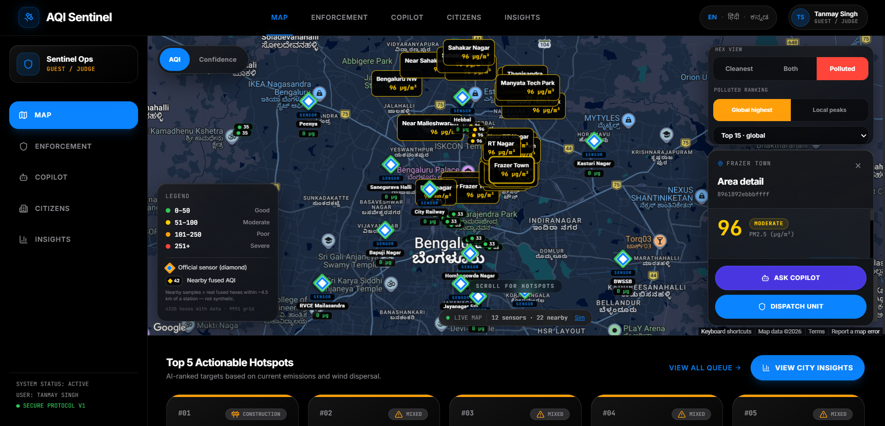
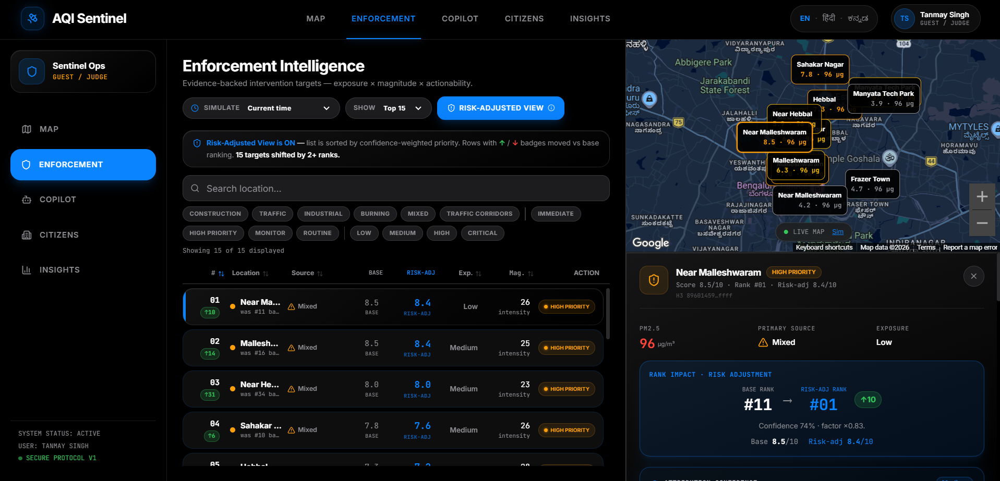
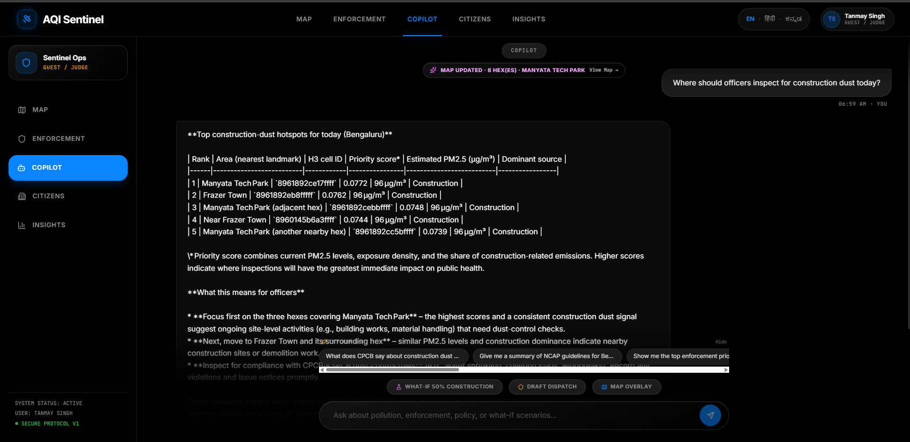
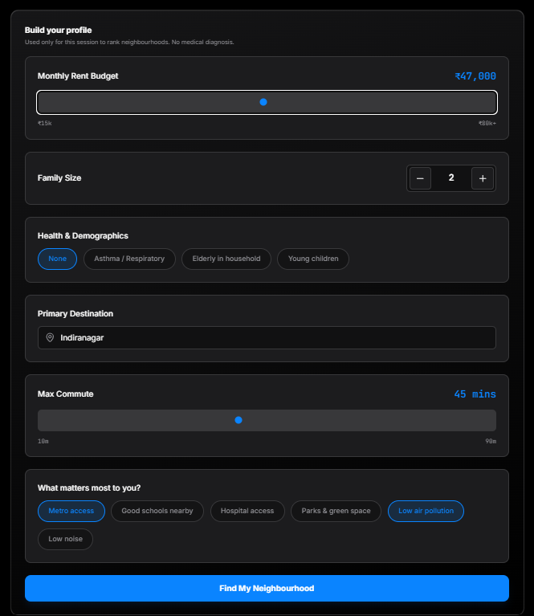
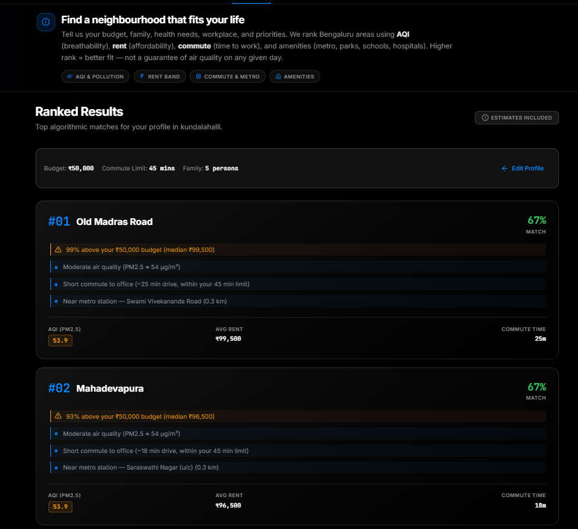
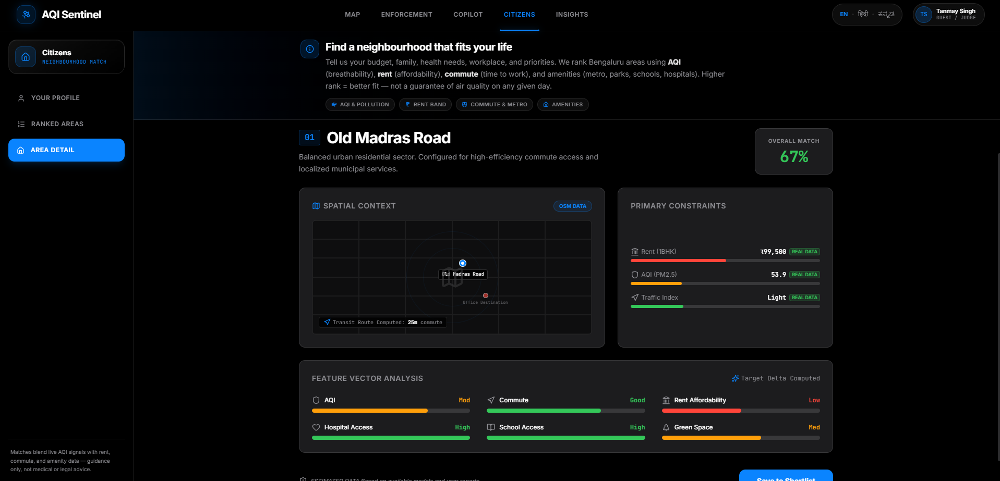
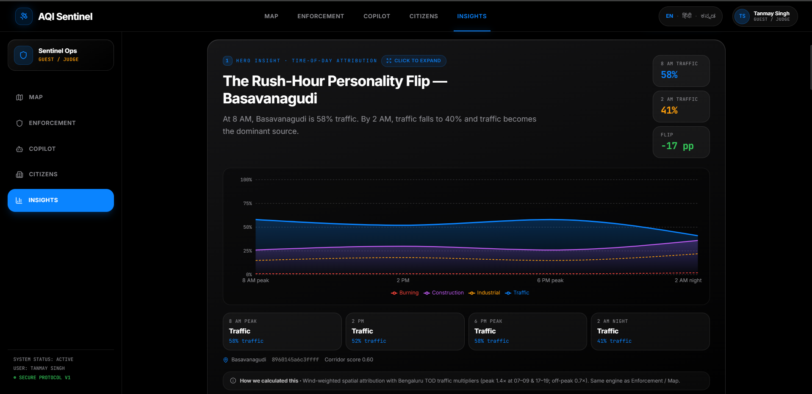
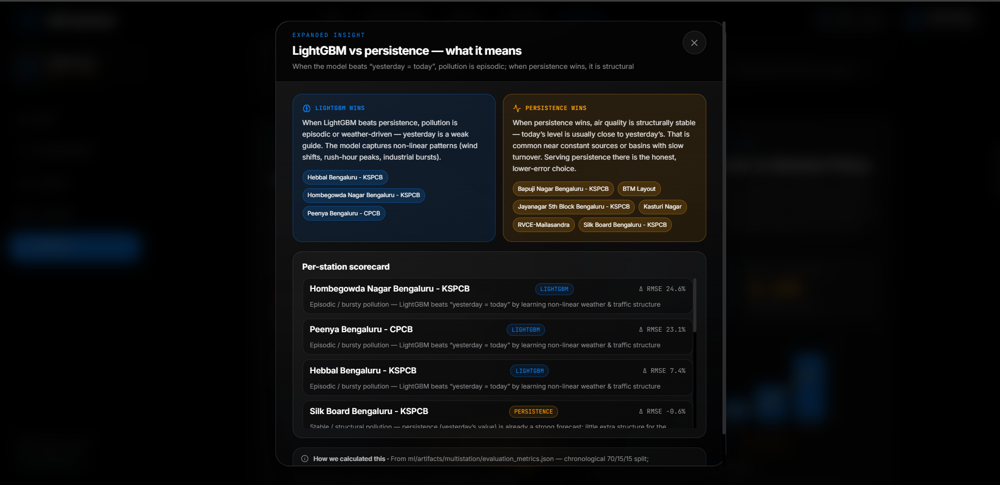
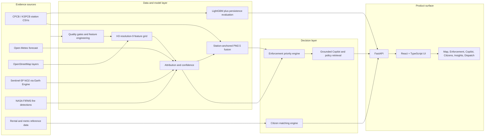

# AQI Sentinel

> **From air-quality readings to defensible city action.** AQI Sentinel is a Bengaluru-first urban air-quality intelligence platform that fuses ground observations, geospatial evidence, weather, satellite context, and operational rules into explainable enforcement priorities and citizen guidance.

Built for **Problem Statement 5 — AI-Powered Urban Air Quality Intelligence for Smart City Intervention**.



## Why this matters

Air-quality platforms commonly stop at a number: *the AQI is high*. AQI Sentinel is designed to answer the next questions responsibly:

- **Where should officers act first?** A citywide H3 grid ranks locations by exposure, attributable pollution magnitude, and the practicality of intervention.
- **What is likely contributing at this location?** The detailed map engine combines upwind spatial context, wind direction, roads, land use, construction, industrial context, fire detections, and satellite NO₂ context into an investigation hypothesis.
- **How certain is the signal?** Attribution confidence, station distance, data freshness, forecast error, fusion coverage, and fallbacks are exposed instead of hidden.
- **What does it mean for residents?** Citizen Mode ranks neighbourhoods against a person’s budget, commute, health sensitivity, amenities, and air quality.

This is an **operational decision-support prototype**, not a legal source-identification system or a medical diagnostic product. Source attribution indicates where to investigate; it does not prove that a particular entity caused a reading.

## Judge’s first look

| What to inspect | What the prototype demonstrates |
| --- | --- |
| **Innovation** | Wind-aware spatial attribution, station-anchored PM2.5 fusion, transparent confidence-aware re-ranking, and an AI copilot grounded in tool outputs and policy knowledge. |
| **Business impact** | Converts a citywide surface into ranked inspection targets and source-specific action templates; provides a resident-facing decision layer rather than a dashboard alone. |
| **Technical excellence** | FastAPI + React/TypeScript, H3 resolution-9 grid, vectorized citywide ranking, LightGBM vs persistence evaluation, source/status flags, and 60+ automated tests. |
| **Scalability** | Data providers, H3 grid construction, station registry, artifacts, and city routing are separated; Bengaluru is the current implementation, not an architectural ceiling. |
| **User experience** | Map, enforcement queue, Copilot, Citizen Mode, dispatch workflow, and insights are one coherent product surface, with English, Hindi, and Kannada UI wiring. |

## Core capabilities

### 1. Hyperlocal map and evidence layers

- Uses an **H3 resolution-9 grid** across Bengaluru (about 10,000 cells; approximately 174 m edge length) rather than treating a few stations as the whole city.
- Shows station readings, fused PM2.5 where a station anchor is within 5 km, source fractions, confidence, and global/local-peak hotspot modes.
- Uses a full wind-weighted attribution path for a selected cell, including a calm-wind fallback that is explicitly labelled.

### 2. Enforcement Intelligence



- Ranks H3 cells with the inspectable formula **Exposure × Attributable Magnitude × Actionability**.
- Accounts for vulnerable locations (schools, hospitals, elderly-care POIs), residential context, fused PM2.5, source mix, major-road corridors, and time of day.
- Has a **Risk-Adjusted View** that downweights high scores where station support or attribution reliability is weak.
- Produces targeted actions for construction dust, traffic, industrial compliance, or open-burning investigations. A single-source label appears only when a source share reaches 80%; otherwise the UI says **Mixed**.

### 3. Forecasting and honest uncertainty

- Trains a pooled 24-hour PM2.5 LightGBM model on nine forecast-eligible Bengaluru stations, with station-specific interaction features.
- Benchmarks it against a persistence baseline (“tomorrow ≈ the observation 24 hours earlier”) using a chronological 70/15/15 split.
- Serves the lower-test-RMSE model **per station**, rather than pretending one model wins everywhere.
- Returns an approximate `prediction ± selected-model RMSE` interval and an uncertainty level.

### 4. Grounded Copilot and what-if reasoning



- Uses native LLM tool calling when a configured provider is available, with Groq-first, Gemini, and OpenRouter fallback support.
- Grounds numeric claims in tool results, records an audit trail, uses map context bidirectionally, and falls back to deterministic tool orchestration if an LLM is unavailable.
- Supports bounded source-reduction what-if scenarios. These are clearly labelled **simulations**, use a linear source-share model, and include an illustrative uncertainty band.

### 5. Citizen Mode

| Profile | Ranked results | Detail and constraints |
| --- | --- | --- |
|  |  |  |

- Ranks localities using a transparent, profile-weighted blend of rent fit, AQI, commute, parks, hospitals, schools, noise, and metro access.
- Raises the AQI weight for respiratory, elderly, and young-child profiles.
- Refines a short list with Google Routes when configured; otherwise it labels commute as an estimate. AQI and rent fields retain estimation flags.

### 6. Insight and decision-explanation layer





The Insights screen explains time-of-day source changes, coverage gaps, forecast-model selection, enforcement concentration, and rent-versus-air-quality trade-offs using computed artifacts rather than static marketing cards.

## System at a glance



Read the full architecture and data flow in [Architecture & Data Flow](docs/ARCHITECTURE_AND_DATA_FLOW.md).

## Evidence at a glance

| Artifact-backed fact | Current implementation |
| --- | --- |
| Ground-station coverage | 12 registered Bengaluru stations; 9 are forecast-eligible after data-quality gating. |
| Training/evaluation | 8,576 chronological held-out test rows across the 9 eligible stations. |
| Pooled 24-hour forecast RMSE | LightGBM: **18.4730 µg/m³**; persistence: **18.5552 µg/m³**. |
| Per-station serving | LightGBM is selected at 3 stations; persistence is selected at 6 where it has lower test RMSE. |
| Spatial operating bounds | Attribution considers source cells within 3 km; PM2.5 fusion only appears inside 5 km of an eligible station. |
| Transparency behaviour | Missing, stale, estimated, forecast-ineligible, calm-wind, and feature-proxy conditions are represented in service payloads/UI rather than fabricated. |

The evaluation method, station-level results, and what has **not** yet been validated are documented in [Benchmarks & Validation](docs/BENCHMARKS.md).

## Repository guide

| Document | Use it for |
| --- | --- |
| [Features & Scoring](docs/FEATURES_AND_SCORING.md) | Exact formulas for attribution, fusion, confidence, enforcement, forecast selection, citizen matching, and what-if outputs. |
| [Architecture & Data Flow](docs/ARCHITECTURE_AND_DATA_FLOW.md) | Source provenance, offline and runtime flows, services, APIs, artifacts, and scaling path. |
| [Benchmarks & Validation](docs/BENCHMARKS.md) | Real evaluation metrics, station results, quality gates, validation boundaries, and reproducibility commands. |
| [Setup & API Keys](docs/SETUP_AND_API_KEYS.md) | A judge-friendly Windows setup guide, which keys are optional, how to obtain/restrict them, and exact `.env` placement. |
| [Judge Demo Guide](docs/JUDGE_DEMO_GUIDE.md) | A concise 5–7 minute demonstration path with prompts and the point each screen proves. |

## Quick start

The checked-in data and artifacts support an offline local demonstration. Google Maps, external live data refreshes, routing/geocoding, and LLM Copilot enhancement have separate optional keys.

```powershell
# From the repository root
python -m venv .venv
.\.venv\Scripts\Activate.ps1
python -m pip install --upgrade pip
python -m pip install -r requirements.txt

Copy-Item .env.example .env
Copy-Item frontend\.env.example frontend\.env

Set-Location frontend
npm ci
Set-Location ..
```

Start the API in one terminal:

```powershell
.\.venv\Scripts\python.exe -m uvicorn backend.app.main:app --reload --port 8010
```

Start the frontend in a second terminal:

```powershell
Set-Location frontend
npm run dev
```

Open `http://localhost:3000`. FastAPI’s interactive API documentation is at `http://127.0.0.1:8010/docs`.

For all API-key setup, source-specific instructions, and security restrictions, see [Setup & API Keys](docs/SETUP_AND_API_KEYS.md).

## Verification

```powershell
# Backend tests
.\.venv\Scripts\python.exe -m pytest -q

# Frontend checks
Set-Location frontend
npm run lint
npm run build
```

## Scope and responsible-use boundaries

- **Current city:** Bengaluru. The registry and data layouts are multi-city-ready, but only Bengaluru is fully instrumented and documented.
- **Forecast horizon:** 24 hours. Weather retrieval supports a 72-hour horizon; the 24–72 hour AQI forecasting extension remains future work.
- **Source attribution:** an evidence-weighted investigation hypothesis, not an emission inventory, dispersion-model substitute, or legal causality finding.
- **Satellite context:** Sentinel-5P NO₂ is a coarse (kilometre-scale) column-density proxy; it is not a 174 m pollution measurement.
- **Citizen guidance:** informational only, not medical, housing, or legal advice.

## Technology

**Backend:** Python, FastAPI, Pandas, NumPy, LightGBM, scikit-learn, H3, GeoPandas/Shapely, Earth Engine API, LangGraph-compatible orchestration.

**Frontend:** React, TypeScript, Vite, TanStack Query, Google Maps, Recharts, Tailwind CSS, Motion.

**Data:** CPCB/KSPCB exports, Open-Meteo, OpenStreetMap, NASA FIRMS, Sentinel-5P TROPOMI, OpenAQ discovery/audit support, and locality/rental reference artifacts.

